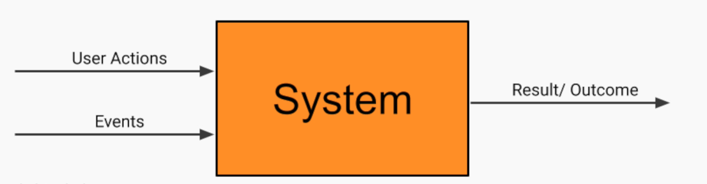

## Desing Hitchikking Service

### High Level Requirement
- Create a service where drivers can offer available seats in their vehicles to passengers who are willing to pay a fee to join them on their route.
- Allow people to join driver on route, who are willing to take passengers for a fee.

### Clarifying Quetions
- Real time vs Advanced Reservations
- User Exp- Mob, Desktop or Both
- Payment through us or direct payment

### Type of Requirements:
- Feature of the system
    - Functional Requirements
- Quality Attributes:
    - Non-Functional Requirement
- System Constraints
    - Limitations and boundaries

### Feature/Functional Requirements
- Describe the system behavior - what the system do?

### Quality Attributes:
- System properties that must have:
- Example:
    - Scalability 
    - Availablity
    - Reliability 
    - Security 
    - Performance
    - .....

### System Constraints:
- Time Constraints - Deadline
- Financial Constraints -  Limited Budget
- Staffing Constraints - like how many engineers availabel for work.