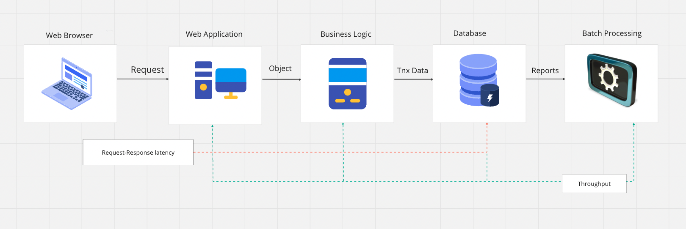

# What is System Design?
The system design of a system is high level description of the system's structure, its different components, and how these components are communicating with each other to fullfil the system requirements and constraints.

# Key Attributes of System Design
- Peformance
- Scalability
- Reliability
- Security
- Deployment

## Performance
- Performance measure of how fast or responsive a system in under circumstances:
    - A given workload
        - Backend Data
        - Request Volume
    - A given hardware
        - Kind
        - Capacity
## Performance Principles
- Efficiency
    - Efficience Resource Utilization
        - IO- Memory, Network, Disk
        - CPU
    - Efficient Login
        - Algorithms
        - DB Queries/Schema
    - Caching
- Concurrency
    - Hardware
    - Software
        - Queuing
        - Coherence
- Capacity

## System Performance Objectives
- Minimise request-response latency
- Latency is measured in time units
- Depends on 
    - Wait/idle time
    - Processing time
- Maximise Throughput
- Throughput is measured on how many request a system can process at a given time.
- Depends on
    - Latency
    - Capacity

## Performance Measurement Metrics
- Latency
    - Affects : User Experience
    - Desired : As low as possible
- Throuhgput
    - Affects: No of users that can be supported by system
    - Desired: Greater than the request rate
- Errors   
    - Affects: Functional Correctness
    - Desired: None
- Resource Saturation
    - Affects: Hardware capacity required
    - Desired: Efficient utilization of all system resources
